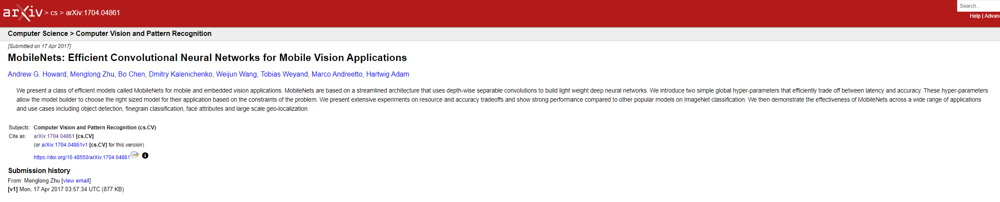
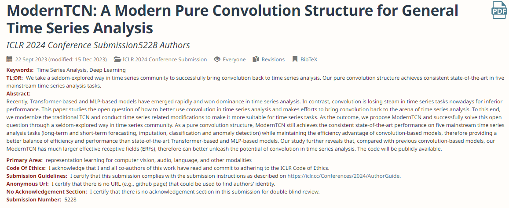
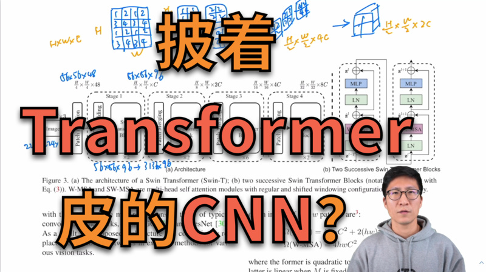

# 深度学习论文阅读汇总&参考文章

## 阅读完成的论文

|         日期 | 标题                                                                        | 封面                                                                                                                      |      | 视频/文章（播放数）                                                                                                                                                                                                                                                                                                                                                                                                                                                                                                                                                                                              |
|-----------:|---------------------------------------------------------------------------|-------------------------------------------------------------------------------------------------------------------------|-----:|---------------------------------------------------------------------------------------------------------------------------------------------------------------------------------------------------------------------------------------------------------------------------------------------------------------------------------------------------------------------------------------------------------------------------------------------------------------------------------------------------------------------------------------------------------------------------------------------------------|
| 2024-03-20 | [Transformer](https://arxiv.org/abs/1706.03762) 精读                        |           |      |  [参考链接](https://www.zhihu.com/question/445556653/answer/3254012065)  [解释参考](https://zhuanlan.zhihu.com/p/410776234)  [论文解释](https://zhuanlan.zhihu.com/p/311156298)  [代码解释](https://zhuanlan.zhihu.com/p/411311520)                                                                                                                                                             |
| 2024-03-13 | [Autoformer](https://arxiv.org/abs/2106.13008) 精读                         |           |      |  [参考链接](https://zhuanlan.zhihu.com/p/385066440)  [代码解释参考](https://blog.csdn.net/weixin_45193103/article/details/124110282)                                                                                                                                                                                                                                                                                                                                                                  |
| 2024-03-07 | [Transformers in Time Series...](https://arxiv.org/pdf/2202.07125.pdf) 精读 |           |      |  [参考链接](https://zhuanlan.zhihu.com/p/686746400)                                                                                                                                                                                                                                                                                                                                                                                                                                                                                                   |
| 2024-01-15 | [TimesNet](https://arxiv.org/pdf/2210.02186.pdf) 精读                       |  |      |  [参考链接](https://zhuanlan.zhihu.com/p/606575441)                                                                                                                                                                                                                                                                                                                                                                                                                                                                                                   |
| 2024-01-09 | [MobileNets](https://arxiv.org/pdf/1704.04861.pdf) 精读                     |                                                            |      |  [参考链接](https://zhuanlan.zhihu.com/p/644454422)                                                                                                                                                                                                                                                                                                                                                                                                                                                                                                   |
| 2024-01-05 | [ModernTCN](https://openreview.net/forum?id=vpJMJerXHU) 精读                |                                                                          |      |  [参考链接](https://zhuanlan.zhihu.com/p/668946041)                                                                                                                                                                                                                                                                                                                                                                                                                                                                                                   |
| 2024-11-20 | [Swin Transformer](https://arxiv.org/pdf/2103.14030.pdf) 精读               |                                                                   |      |        |

## 所有论文

### 时间序列的预测

| 已阅读 | 年份        | 名字                                                      | 简介 | 引用                                              |
|-----|-----------|---------------------------------------------------------|----|-------------------------------------------------|
| ✅   | 2024 ICLR | [ModernTCN](https://openreview.net/forum?id=vpJMJerXHU) | 暂无 |  |

### 时间序列

| 已阅读 | 年份   | 名字                 | 简介 | 引用 |
|-----|------|--------------------|----|----|
| ✅   | XXXX | [paper](paper.url) | 暂无 |    |

### 计算机视觉 - Transformer

| 已阅读 | 年份   | 名字                                                       | 简介                     | 引用                                                                                                                                                                                                                                                                                                                                                                         |
|-----|------|----------------------------------------------------------|------------------------|----------------------------------------------------------------------------------------------------------------------------------------------------------------------------------------------------------------------------------------------------------------------------------------------------------------------------------------------------------------------------|
| ✅   | 2021 | [Swin Transformer](https://arxiv.org/pdf/2103.14030.pdf) | 多层次的Vision Transformer |  |
