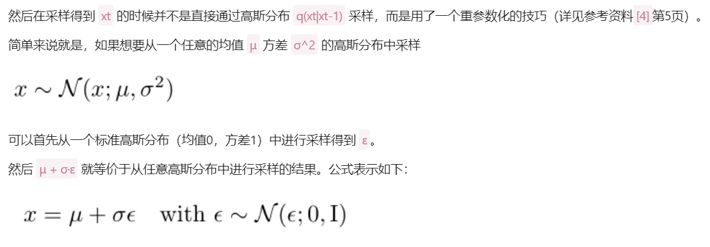
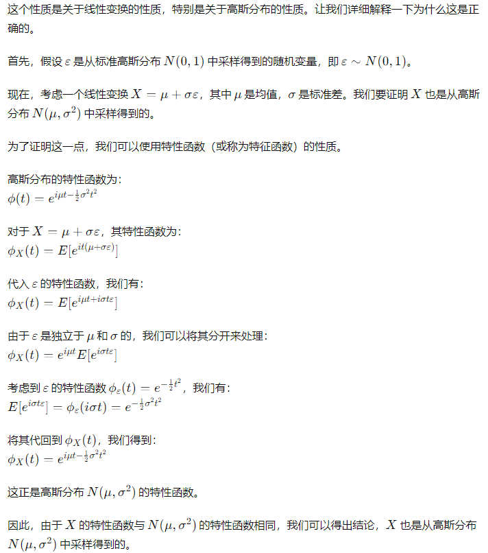
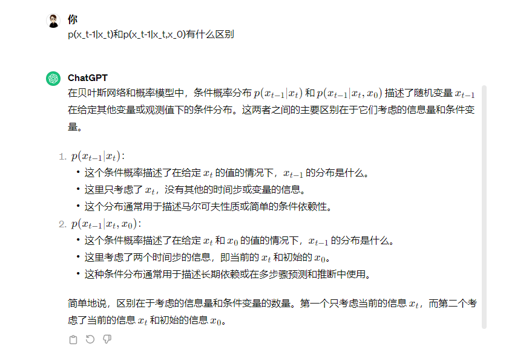
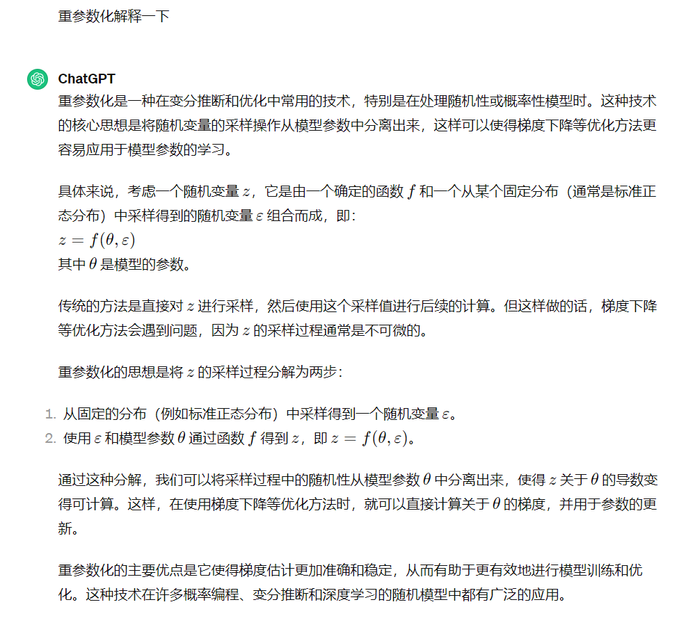
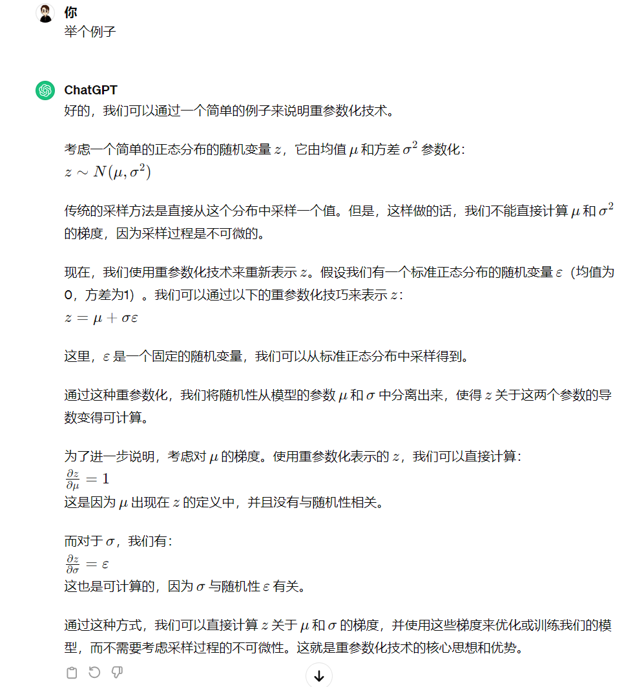
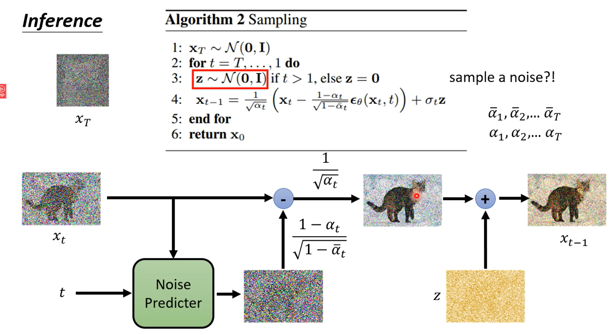
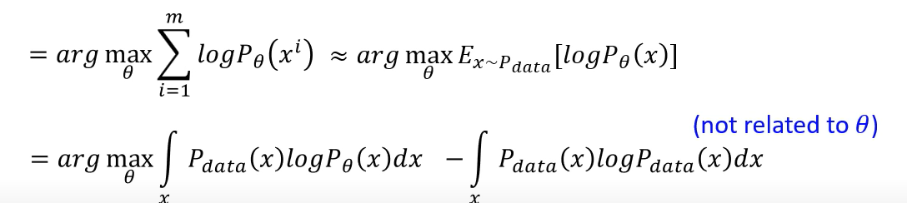
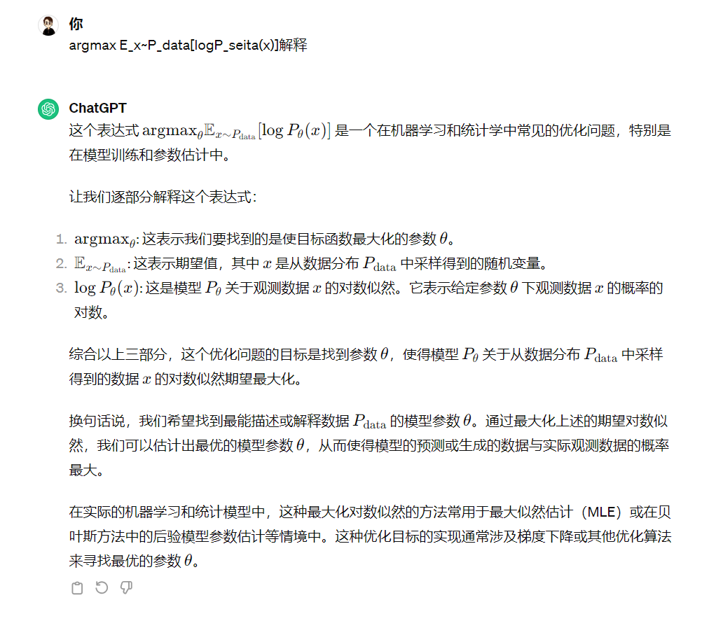
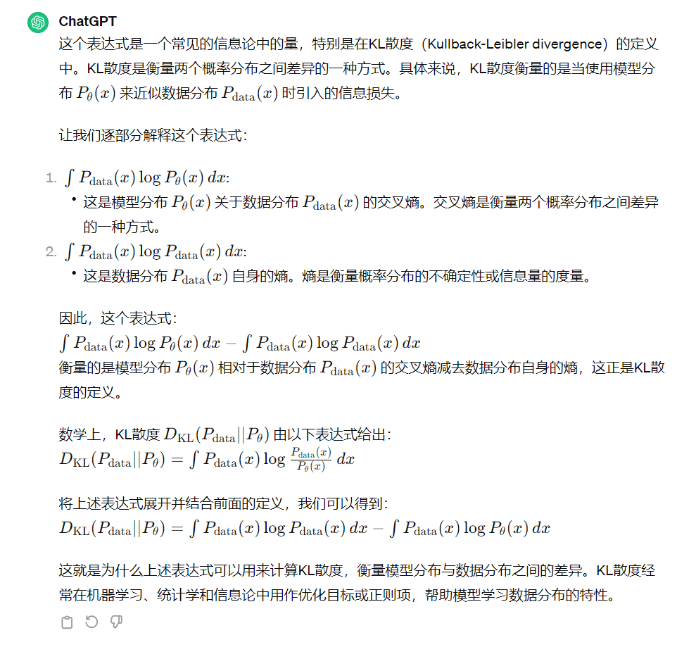

马尔可夫链解释 https://zhuanlan.zhihu.com/p/26453269

## 扩散模型 参考内容

 一文弄懂 Diffusion Model https://www.cvmart.net/community/detail/6936

Diffusion Models：生成扩散模型 https://yinglinzheng.netlify.app/diffusion-model-tutorial/

## 重参数化

